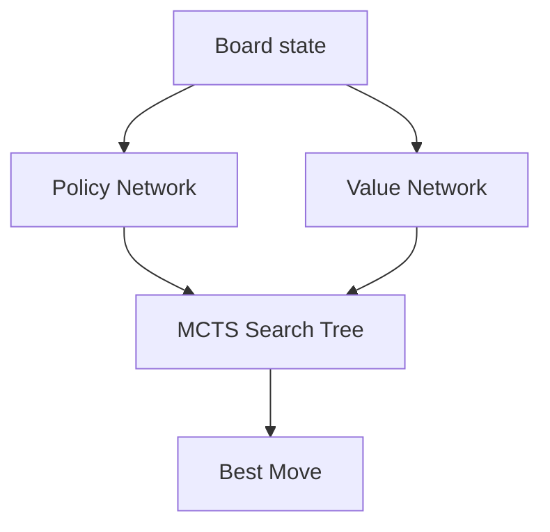

# Overview:

This blog will run through the algorithms and all kinds of details in the Alphago 2016 version. The strategy of brute forcing the moves are compatible with chess but not with Go since the amount of space need to be search is just too much. AlphaGo is not a super big neural network but a combination of three main systems, which are **Neural Network**, **Monte Carlo Tree Search** and **Reinforcement learning**. It let neural network handle "intuition", and search handles "reasoning". 

# Representing Go as a Computational Problem

Above all, we need to transform the board and other information into things that computer can understand. The mathematical object for this:
$$
s \in S
$$

where $s$ denotes a particular board state and $S$ is the set of all possible board states

Besides board states which is the most important information, current player is also an important information. Therefore, a complete state can be describled as:

$$
s = (board, player)
$$

Then, we need to represent a move. In the game, a move can be defined as placing a stone on a empty intersection under the premise of being allowed by the rules.
There should also have an action space $A$ which includes all the possible actions(move) $a$ under the premission of the rules for a board configuration.
$$
a \in A
$$
The available actions depends on the current state. Therefore, we define:
$$
A(s)
$$
as the set of all the legal move under state $s$.

We have defined what a state is and what actions can be taken under any certain state. After an action is executed, the state transition function:
$$
s \prime  = f(s, a)
$$
defining the successor state after selecting action $a$ in state $s$.

# Policy and Value functions

## Policy functions

