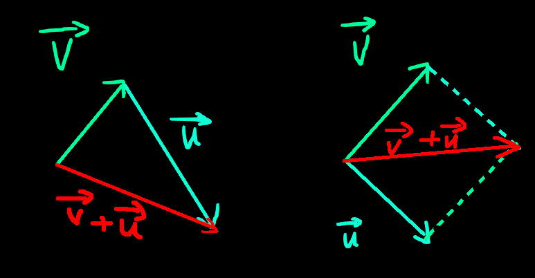
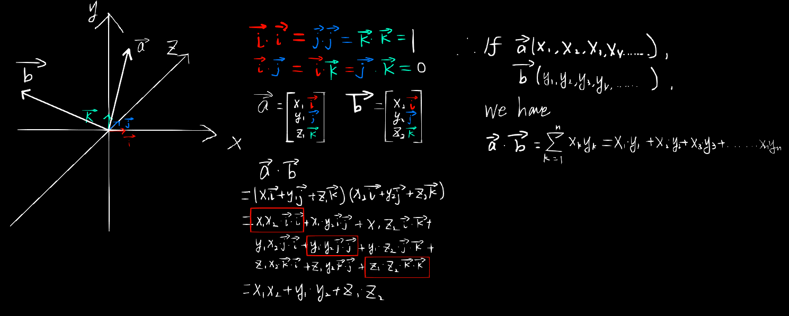

# Vectors And Matrices

Vectors and matrices are the fundamental elements in the engine. They are capable for so many things and act important roles in different areas. I'm going to introduce some properties about them from a mathematical way.

## Vectors

### Definition of a Vector:

A vector possesses **magnitude** (its size or length) and **direction**. Unlike a scalar quantity, which is defined only by its magnitude, a vector requires both a value and an orientation in the space to be fully described.

In an $n$ dimensional space, a vector can be represented as: 
$$
\vec{v} = \begin{pmatrix} v_{1} \\ v_{2} \\ v_{3} \\ \vdots \\ v_{n} \end{pmatrix}
$$

Its magnitude can be expressed as:
$$
\lVert \vec{v}\rVert = \sqrt{v_{1}^{2} + v_{2}^{2} + v_{3}^{2} + \dots + v_{n}^{2}} = \sqrt{\sum_{i=1}^n v_{i}^{2}}
$$

Its direction can be expressed by its unit vector:
$$
\hat{v} = \frac{\vec{v}}{\lVert \vec{v} \rVert} = \begin{pmatrix} \frac{v_{1}}{\lVert \vec{v} \rVert} \\ \frac{v_{2}}{\lVert \vec{v} \rVert} \\ \frac{v_{3}}{\lVert \vec{v} \rVert} \\ \vdots \\ \frac{v_{n}}{\lVert \vec{v} \rVert} \end{pmatrix}
$$

### Vector Properties:

- Commutativity of Addition: $\vec{u} + \vec{v} = \vec{v} + \vec{u}$
- Associativity of Addition: $(\vec{u} + \vec{v}) + \vec{w} = \vec{u} + (\vec{v} + \vec{w})$
- Distributivity: $c(\vec{u} + \vec{v}) = c\vec{u} + c\vec{v}$
- Zero Vector: There exists a unique zero vector $\vec{0} = \left( 0, 0, \dots, 0 \right)$ such that $\vec{v} + \vec{0} = \vec{v}$.

### Vector Operations:

#### Addition & Subtraction:
The sum of two vectors $\vec{v}$ and $\vec{u}$ can be visualized by using the **Triangle Law** or the **Parallelogram Law**:

Subtraction can also use these two method by adding the negative vectors.

#### The Dot Product:

The dot product of two vectors $\vec{v}$ and ${\vec{u}}$ results in a scalar which can be used in countless areas. It is crucial for determining the angle between the vectors.
**Geometric Interpretation**: 
$$
\vec{v} \cdot \vec{u} = \lVert \vec{v} \rVert \lVert \vec{u} \rVert \cos(\theta)
$$
Here $\theta$ is the angle between $\vec{v}$ and $\vec{u}$.

**Algebraic Definition**:
$$
\vec{v} \cdot \vec{u} = v_{1} \cdot u_{1} + v_{2} \cdot u_{2} + \dots + v_{n} \cdot u_{n} = \Sigma_{i = 1}^{n} v_{i} u_{i}
$$

**Derivation**:
Consider the dot product in 3 dimensional space where any two vectors can be expressed as $\vec{v}=(x_{1}, y_{1}, z_{1})$ and $\vec{u}=(x_{2}, y_{2}, z_{2})$. The orthonormal basis in the space have these properties:
$$
\begin{aligned}
    \hat i \cdot \hat i = \hat j \cdot \hat j = \hat k \cdot \hat k = 1 \\
    \hat i \cdot \hat j = \hat i \cdot \hat k = \hat j \cdot \hat k = 0
\end{aligned}
$$
The two vectors can then be expressed as:
$$
\begin{aligned}
    \vec{v} = \begin{bmatrix}
        x_{1} \hat i \\ 
        y_{1} \hat j \\
        z_{1} \hat k
        \end{bmatrix}
    \vec{u} = \begin{bmatrix}
        x_{2} \hat i \\ 
        y_{2} \hat j \\
        z_{2} \hat k
        \end{bmatrix}
\end{aligned}
$$

So, we have:
$$
\begin{split}
\vec{v} \cdot \vec{u}
&= (x_{1} \hat i + y_{1} \hat j + z_{1} \hat k) \cdot (x_{2} \hat i + y_{2} \hat j + z_{2} \hat k) \\
&= x_{1} x_{2} \hat i \cdot \hat i + x_{1} y_{2} \hat i \cdot \hat j + x_{1} z_{2} \hat i \cdot \hat k + \\
& \phantom{=} y_{1} x_{2} \hat j \cdot \hat i + y_{1} y_{2} \hat j \cdot \hat j + y_{1} z_{2} \hat j \cdot \hat k + \\
& \phantom{=} z_{1} x_{2} \hat k \cdot \hat i + z_{1} y_{2} \hat k \cdot \hat j + z_{1} z_{2} \hat k \cdot \hat k \\
&= x_{1} x_{2} \hat i \cdot \hat i + y_{1} y_{2} \hat j \cdot \hat j + z_{1} z_{2} \hat k \cdot \hat k \\
&= x_{1} x_{2} + y_{1} y_{2} + z_{1} z_{2}
\end{split}
$$

Here is a handwriten note to help you understand.

From the geometric definition, we can derive the relationship for the angle:
$$
\cos(\theta) = \frac{\vec{v} \cdot \vec{u}}{\lVert \vec{v} \rVert \lVert \vec{u} \rVert}
$$

If $\vec{v} \cdot \vec{u} > 0$, the angle $\theta$ is actue ($0 \leq \theta < \frac{\pi}{2}$).
If $\vec{v} \cdot \vec{u} = 0$, the angle $\theta = \frac{\pi}{2}$, meaning the vectors are perpendicular to each other.
If $\vec{v} \cdot \vec{u} < 0$, the angle $\theta$ is obtuse ($\frac{\pi}{2} < \theta \leq \pi$).

#### The Cross Product:

The cross product is only defined for vectors in three-dimensional space.

**Geometric Interpretation**:
1. Direction: The resulting vector $\vec{v} = \vec{u} \times \vec{w}$ is perpendicular to the plane spanned by $\vec{u}$ and $\vec{w}$. The direction of $\vec{v}$ is determined by the **right-hand rule**. 
2. Magnitude: The magnitude of the resulting vector is given by:
$$
\lVert \vec{u} \times \vec{w} \rVert = \lVert \vec{u} \rVert \lVert \vec{w} \rVert \sin(\theta)
$$

Special Cases:
- Parallel Vectors ($\theta = 0 \enspace or \enspace \pi$): $\sin(\theta)=0$, so $\vec{u} \times \vec{w} = 0$. (The Zero Vector)
- Orthogonal Vectors($\theta = \frac{\pi}{2}$): $\sin(\frac{\pi}{2}) = 1$, so $\lVert \vec{u} \times \vec{w} \rVert = \lVert \vec{u} \rVert \lVert \vec{w} \rVert$. The resulting vector is the largest possible magnitude for the given lengths.

**Algebraic Interpretation**:
For vectors $a=(a_{x},a_{y},a_{z})$, $b=(b_{x},b_{y},b_{z})$, $\hat i, \hat j, \hat k$ is unit vectors for x, y, z respectively(orthonormal basis). We have:
$$
\vec{a} \times \vec{b} = \begin{vmatrix}
    i & j & k \\
    a_{x} & a_{y} & a_{z} \\
    b_{x} & b_{y} & b_{z}
\end{vmatrix} = (a_{y} b_{z} - a_{z} b_{y}) \hat i + (a_{z} b_{x} - a_{x} b_{z}) \hat j + (a_{x} b_{y} - a_{y} b_{x}) \hat k
$$

In coordinate form:
$$
\vec{a} \times \vec{b} = (a_{x}, a_{y}, a_{z}) \times (b_{x}, b_{y}, b_{z}) = (a_{y} b_{z} - a_{z} b_{y}, a_{z} b_{x} - a_{x} b_{z}, a_{x} b_{y} - a_{y} b_{x})
$$

**Derivation**:

For the unit vectors $\hat i, \hat j, \hat k$, they have the following properties:
1. $\hat i \times \hat j = \hat k, \hat j \times \hat k = \hat i, \hat k \times \hat i = \hat j$
2. $\hat j \times \hat i = - \hat k, \hat k \times \hat j = - \hat i, \hat i \times \hat k = - \hat j$
3. $\hat i \times \hat i = \hat j \times \hat j = \hat k \times \hat k = 0$

For $\vec{u}$ and $\vec{v}$ which are in the coordinate system consisting of $\hat i, \hat j, \hat k$ can be expressed as:
$$
\begin{aligned}
    \vec{u} = x_{u} \hat i + y_{u} \hat j + z_{u} \hat k \\
    \vec{v} = x_{v} \hat i + y_{v} \hat j + z_{v} \hat k \\
\end{aligned}
$$

Then calculate $\vec{u} \times \vec{v}$:
$$
\begin{split}
\vec{u} \times \vec{v}
&= (x_{u} \hat i + y_{u} \hat j + z_{u} \hat k) \times (x_{v} \hat i + y_{v} \hat j + z_{v} \hat k) \\
&= x_{u} x_{v} (\hat i \times \hat i) + x_{u} y_{v} (\hat i \times \hat j) + x_{u} z_{v} (\hat i \times \hat k) + \\
& \phantom{=} y_{u} x_{v} (\hat j \times \hat i) + y_{u} y_{v} (\hat j \times \hat j) + y_{u} z_{v} (\hat j \times \hat k) + \\
& \phantom{=} z_{u} x_{v} (\hat k \times \hat i) + z_{u} y_{v} (\hat k \times \hat j) + z_{u} z_{v} (\hat k \times \hat k) \\
&= (y_{u} z_{v} - z_{u} y_{v}) \hat i + (z_{u} x_{v} - x_{u} z_{v}) \hat j + (x_{u} y_{v} - y_{u} x_{v}) \hat k
\end{split}
$$

## Matrices

Matrices is a set of numbers in a rectangular array.

A table of numbers in $m$ rows and $n$ columns arranged by $m \times n$ numbers is called a $m \times n$ matrix. Denoted as:

$$
A = \begin{bmatrix}
    a_{11} & a_{12} & \dots & a_{1n} \\
    a_{21} & a_{22} & \dots & a_{2n} \\
    \vdots & \vdots & \ddots & \vdots \\
    a_{m1} & a_{m2} & \dots & a_{mn}
\end{bmatrix}
$$

### Matrix Operations:

#### Addition & Subtraction:

$$
\begin{bmatrix}
    a_{11} & a_{12} & \dots & a_{1n} \\
    a_{21} & a_{22} & \dots & a_{2n} \\
    \vdots & \vdots & \ddots & \vdots \\
    a_{m1} & a_{m2} & \dots & a_{mn}
\end{bmatrix} + 
\begin{bmatrix}
    b_{11} & b_{12} & \dots & b_{1n} \\
    b_{21} & b_{22} & \dots & b_{2n} \\
    \vdots & \vdots & \ddots & \vdots \\
    b_{m1} & b_{m2} & \dots & b_{mn}
\end{bmatrix} = 
\begin{bmatrix}
    a_{11} + b_{11} & a_{12} + b_{12} & \dots & a_{1n} + b_{1n} \\
    a_{21} + b_{21} & a_{22} + b_{22} & \dots & a_{2n} + b_{2n} \\
    \vdots & \vdots & \ddots & \vdots \\
    a_{m1} + b_{m1} & a_{m2} + b_{m2} & \dots & a_{mn} + b_{mn}
\end{bmatrix}
$$

Addition of matrices satisfies the following operator laws:
$$
\begin{align}
    A + B &= B + A \\
    (A + B) + C &= A + (B + C)
\end{align}
$$

#### Scalar Multiplication:
$$
k \cdot
\begin{bmatrix}
    a_{11} & a_{12} & \dots & a_{1n} \\
    a_{21} & a_{22} & \dots & a_{2n} \\
    \vdots & \vdots & \ddots & \vdots \\
    a_{m1} & a_{m2} & \dots & a_{mn}
\end{bmatrix} =
\begin{bmatrix}
    k \cdot a_{11} & k \cdot a_{12} & \dots & k \cdot a_{1n} \\
    k \cdot a_{21} & k \cdot a_{22} & \dots & k \cdot a_{2n} \\
    \vdots & \vdots & \ddots & \vdots \\
    k \cdot a_{m1} & k \cdot a_{m2} & \dots & k \cdot a_{mn}
\end{bmatrix}
$$

The scalar multiplication of a matrix satisfies the following operator laws:
$$
\begin{aligned}
    \lambda(\mu A) &= \mu(\lambda A) \\ 
    \lambda(\mu A) &= (\lambda \mu) A \\ 
    (\lambda + \mu) A &= \lambda A + \mu A \\
    \lambda(A + B) &= \lambda A + \lambda B 
\end{aligned}
$$

#### Transpose:
The matrix resulting from interchanging the rows and the columns of the matrix A is called the transposed matrix of A ($A^T$)
$$
\begin{bmatrix}
    a_{11} & a_{12} & a_{13} \\
    a_{21} & a_{22} & a_{23} \\
\end{bmatrix} ^ T = \begin{bmatrix}
    a_{11} & a_{21} \\
    a_{12} & a_{22} \\
    a_{13} & a_{23}
\end{bmatrix}
$$

The transpose of a matrix satisifes the following operator laws:
$$
\begin{align}
    (A^T)^T &= A \\
    (\lambda A)^T &= \lambda A^T \\
    (AB)^T &= B^T A^T 
\end{align}
$$

#### Multiplication:
If $A$ is a $m \times n$ matrix and $B$ is a $n \times p$ matrix, their product $C$ is a $m \times p$ matrix $C = (c_{ij})$, any of its element can be expressed as:
$$
c_{i,j} = a_{i,1}b_{1,j} + a_{i,2}b_{2,j} + \cdots + a_{i,n}b_{n,j} = \Sigma_{r=1}^n a_{i,r}b{r,j}
$$
This product can be denoted as: $C = AB$

The multiplication of matrices satisfies following operators:
$$
\begin{align}
    (AB)C = A(BC) \\
    (A+B)C = AC + BC \\
    C(A+B) = CA + CB
\end{align}
$$
