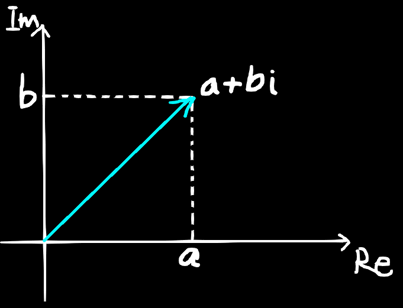

# Complex Number
We call the  numbers of the form $a + bi$ complex numbers.
Set consisting of all complex numbers $\mathbb{C}=\{a+b \mathrm{i}\mid a,b \in \mathbb{R}\}$, complex number is usually represented by letter $z$, so $z=a+b\mathrm{i}(a,b \in \mathbb{R})$ where $a$ is the real part of the number and $b$ is the imaginary part.  A complex number is an imaginary number introduced on top of the real numbers in one dimension, forming a two dimensional complex plane. A particular complex number is a vector in that complex plane, as follows:

## Operations:
### Addition:
Two complex number $z_{1} = a+b\mathrm{i},\ z_{2} = c+d\mathrm{i} \ (a,b,c,d \in \mathbb{R})$ , their sum is:
$$
z_{1} + z_{2} = (a+b\mathrm{i})+(c+d\mathrm{i})=(a+c) + (b+d)\mathrm{i}
$$
For any complex number:
$$
\begin{align}
z_{1} + z_{2} &= z_{2} + z_{1} \\
(z_{1} + z_{2}) + z_{3} &= z_{1} + (z_{2} + z_{3})
\end{align}
$$
### Subtraction:
Two complex number $z_{1} = a+b\mathrm{i},\ z_{2} = c+d\mathrm{i} \ (a,b,c,d \in \mathbb{R})$ , their difference is:
$$
z_{1} - z_{2} = (a+b\mathrm{i})-(c+d\mathrm{i})=(a-c) + (b-d)\mathrm{i}
$$

### Multiplication:
Two complex number $z_{1} = a+b\mathrm{i},\ z_{2} = c+d\mathrm{i} \ (a,b,c,d \in \mathbb{R})$ , their product is:
$$
\begin{align}
z_{1} \cdot z_{2} &= (a+b\mathrm{i}) \cdot (c+d\mathrm{i}) \\
&=ac+ad\mathrm{i}+bc\mathrm{i}+bd\mathrm{i}^2 \\
&=(ac-bd) + (ad+bc)\mathrm{i}
\end{align}
$$
For any complex number:
$$
\begin{align}
z_{1} z_{2} &= z_{2} z_{1} \\
(z_{1} z_{2}) z_{3} &= z_{1} (z_{2} z_{3}) \\
z_{1} (z_{2} + z_{3}) &= z_{1} z_{2} + z_{1} z_{3}
\end{align}
$$

### Division:
Two complex number $z_{1} = a+b\mathrm{i},\ z_{2} = c+d\mathrm{i} \ (a,b,c,d \in \mathbb{R})$ , their quotient is:
$$
\begin{align}
z_{1} \div z_{2} &= \frac{a+b\mathrm{i}}{c+d\mathrm{i}} \\
&= \frac{(a+b\mathrm{i}) (c-d\mathrm{i})}{(c+d\mathrm{i})(c-d\mathrm{i})} \\
&= \frac{ac - ad\mathrm{i} + bc\mathrm{i} + bd}{c^2+d^2} \\
&= \frac{ac+bd}{c^2+d^2} + \frac{bc-ad}{c^2+d^2}\mathrm{i}
\end{align}
$$

## Euler's Formula:
$$
e^{i \theta} = cos(\theta) + \mathrm{i} \sin(\theta) 
$$
### Proof:
The MacLaurin Series for $e^x$:
$$
e^x=\sum_{n=0}^{\infty} \frac{x^n}{n!}=1+x+\frac{x^2}{2}+\frac{x^3}{6}+\cdots
$$
For $e^{\mathrm{i} \theta}$, there exist:
$$
\begin{align}
LHS = e^{\mathrm{i} \theta} &= \sum_{n=0}^{\infty} \frac{(\mathrm{i} \theta)^n}{n!} \\
&= 1 + \mathrm{i} \theta - \frac{\theta^2}{2!} + \frac{(\mathrm{i}\theta)^3}{3!} + \frac{\theta^4}{4!} + \cdots \\
&= \left(1-\frac{\theta^2}{2!} + \frac{\theta^4}{4!} - \frac{\theta^6}{6!} + \cdots \right) + \mathrm{i} \left(\theta - \frac{\theta^3}{3!} + \frac{\theta^5}{5!} - \frac{\theta^7}{7!} + \cdots \right) \\
&= \cos \theta + \mathrm{i} \sin \theta \\
&= RHS
\end{align}
$$
## The derivation for formula of $\cos n\theta$ and $\sin n\theta$:
$$
\begin{align}
\left(e^{\mathrm{i} \theta}\right)^{n} =e^{\mathrm{i}n\theta} &= \cos n\theta + \mathrm{i} \sin n\theta \\
\left( \cos \theta + \mathrm{i} \sin \theta \right)^{n} &= \cos n\theta + \mathrm{i} \sin n\theta \\
\cos n\theta + \mathrm{i} \sin n\theta & = \sum_{k=0}^{n} \binom{n}{k} \left( \cos \theta \right)^{n-k} \left( \mathrm{i} \sin \theta \right)^k
\end{align}
$$
Extract the real and imaginary parts of the expansion separately:
$$
\begin{align}
\cos n\theta &= \sum_{k=0}^{n} \binom{n}{2k} (\cos \theta)^{n-2k} (\mathrm{i} \sin \theta)^{2k} \\
&= \sum_{k=0}^{n} \binom{n}{2k} (-1)^k (\cos \theta)^{n-2k} (\sin \theta)^{2k} \\
\mathrm{i} \sin n\theta &= \sum_{k=0}^{n} \binom{n}{2k+1} (\cos \theta)^{n-2k-1} (\mathrm{i})^{2k+1} (\sin \theta)^{2k+1} \\
&= \mathrm{i} \sum_{k=0}^{n} \binom{n}{2k+1} (\cos \theta)^{n-2k-1} (-1)^k (\sin \theta)^{2k+1} \\
\end{align}
$$
$$
\therefore \quad
\begin{cases}
\cos n\theta &= \sum_{k=0}^{n} \binom{n}{2k} (-1)^k (\cos \theta)^{n-2k} (\sin \theta)^{2k} \\
\sin n\theta &= \sum_{k=0}^{n} \binom{n}{2k+1}(-1)^k (\cos \theta)^{n-2k-1} (\sin \theta)^{2k+1} \\
\end{cases}
$$
### Chebyshev polynomials:
- https://zhuanlan.zhihu.com/p/55076525

# Quaternions
In complex numbers, the multiplication can represent the rotation in 2 dimensional space. For example, by rotating a vector $(a, bi)$ for $30 \degree$, just multiply it by $\cos 30 \degree + \mathrm{i} \sin 30 \degree$. But in three dimensional space, we need something that is stronger than complex numbers since that rotate about the x axis first and then rotate about the y axis is not equal to rotate about the y axis first and then rotate about the x axis,  we need a algebraic system which does not satisfy commutative multiplication and is able to describe rotation in 3 dimensional space. So, the hypercomplex number, quaternions is just the right tool to use.
## Definition:
The numbers in the form of:
$$
q = a + b \mathrm{i} + c \mathrm{j} + d \mathrm{k} (a,b,c,d \in \mathbb{R})
$$
## Basic properties:
$$
\begin{align}
i^2 = j^2 = k^2 = -1 \\
ij = k, ji = -k, jk = i, kj = -i, ki = j, ik = -j
\end{align}
$$

For any quaternions, their conjugate is given by:
$$
q = a - b \mathrm{i} - c \mathrm{j} - d \mathrm{k}
$$

## Operations:
### Addition:
For two quaternions $q = a + b \mathrm{i} + c \mathrm{j} + d \mathrm{k}$ and $p = t + x \mathrm{i} + y \mathrm{j} + z \mathrm{k}$, their sum is:
$$
q+p = (a+t) + (b+x) \mathrm{i} + (c+y) \mathrm{j} + (d+z) \mathrm{k}
$$
For any quaternions:
$$
\begin{align}
q_{1} + q_{2} &= q_{2} + q_{1} \\
(q_{1} + q_{2}) + q_{3} &= q_{1} + (q_{2} + q_{3})
\end{align}
$$

### Subtraction:
For two quaternions $q = a + b \mathrm{i} + c \mathrm{j} + d \mathrm{k}$ and $p = t + x \mathrm{i} + y \mathrm{j} + z \mathrm{k}$, their difference is:
$$
q-p = (a-t) + (b-x) \mathrm{i} + (c-y) \mathrm{j} + (d-z) \mathrm{k}
$$
### Multiplication:
For two quaternions $q = a + b \mathrm{i} + c \mathrm{j} + d \mathrm{k}$ and $p = t + x \mathrm{i} + y \mathrm{j} + z \mathrm{k}$, their product is:
$$
\begin{align}
q \cdot p &= (a + b \mathrm{i} + c \mathrm{j} + d \mathrm{k}) (t + x \mathrm{i} + y \mathrm{j} + z \mathrm{k}) \\
&= at - bx - cy - dz \\
&+ (ax+bt+cz-dy) \mathrm{i} \\
&+ (ay-bz+ct+dx) \mathrm{j} \\
&+ (az+by-cx+dt) \mathrm{k}
\end{align}
$$

Quaternions can also be expressed by a much simpler way:
$q = a + b \mathrm{i} + c \mathrm{j} + d \mathrm{k} = (a, \vec{a})$, where $\vec{a} = (b, c, d)$.
In this way, the multiplication would become:
$$
\begin{align}
q \cdot p &= (a + b \mathrm{i} + c \mathrm{j} + d \mathrm{k}) (t + x \mathrm{i} + y \mathrm{j} + z \mathrm{k}) \\
&= (a, \vec{a}) (t, \vec{t}) \\
&= (at - \vec{a} \cdot \vec{t}, a \vec{t} + t \vec{a} + \vec{a} \times \vec{t})
\end{align}
$$
## Rotation:
We call the quaternions which have a zero real part the Pure Quaternions. For any vector in 3 dimensional space, we can plug it in a pure quaternion $q$:
$$
q = (0, \vec{v}) = 0 + x \mathrm{i} + y \mathrm{j} + z \mathrm{k}
$$
Let's say that we are rotating about a unit vector $\hat{u}$ for $\theta$ angle. Imitate the way of the complex number where we multiply  a $\cos \theta + \mathrm{i} \sin \theta$, we construct a similar quaternion:
$$
q = (\cos \theta, \sin \theta \hat{u})
$$
If we completely follow the steps of the rotation of the complex number, trying to multiply a pure quaternion:
$$
\begin{align}
p \prime &= (\cos \theta, \sin \theta \hat{u}) \cdot (0, \vec{v}) \\
&= (0 - \sin \theta (\hat{u} \cdot \vec{v}), \cos \theta \vec{v} + \sin \theta (\hat{u} \times \vec{v}))
\end{align}
$$
But the real part of this quaternion is not zero which means that unless $\hat{u} \cdot \vec{v} = 0$, the quaternion $p \prime$ won't become a pure quaternion. This means that this equation is unable to handle most of the rotations in 3 dimensional space. We need to multiply another thing to cancel out the non-zero real part.

Let $q$ be a unit quaternion, $v = (0, \vec{v})$ be a pure quaternion, $v\prime = (0, \vec{v}\prime)$ be the pure quaternion after the rotation. Expand and calculate:
$$
\begin{align}
v\prime = qvq^{-1} &= qvq^* \\
&= (s_{q}, \vec{v_{q}}) \cdot (0, \vec{v}) \cdot (s_{q}, -\vec{v_{q}}) \\
&= (- \vec{v_{q}} \cdot \vec{v}, s_{q} \vec{v} + \vec{v_{q}} \times \vec{v}) \cdot (s_{q}, -\vec{v_{q}}) \\
\mathrm{Re}(v\prime) &= s_{q} \cdot (- \vec{v_{q}} \cdot \vec{v}) - (-\vec{v_{q}}) \cdot (s_q \vec{v} + \vec{v_{q}} \times \vec{v}) = 0 \\
\vec{v}\prime &= (-\vec{v_q} \cdot \vec{v}) \cdot (-\vec{v_q}) + s_q \cdot (s_q \vec{v} + \vec{v_q} \times \vec{v}) + (s_q \vec{v} + \vec{v_q} \times \vec{v}) \times (-\vec{v_q}) \\
&= (\vec{v_q} \vec{v}) \cdot \vec{v_q} + s_q^2 \vec{v} + s_q \cdot (\vec{v_q} \times \vec{v}) - s_q (\vec{v} \times \vec{v_q}) - (\vec{v_q} \times \vec{v}) \times \vec{v_q} \\
&= (\vec{v_q} \vec{v}) \cdot \vec{v_q} + s_q^2 \vec{v} + s_q \cdot (\vec{v_q} \times \vec{v}) + s_q (\vec{v_q} \times \vec{v}) - (\vec{v_q} \cdot \vec{v_q}) \cdot \vec{v} + (\vec{v} \cdot \vec{v_q}) \cdot \vec{v_q} \\
&= (s_q^2 - \lvert \lvert \vec{v_q} \rvert \rvert ^2) \vec{v} + 2 s_q (\vec{v_q} \times \vec{v}) + 2(\vec{v} \cdot \vec{v_q}) \cdot \vec{v_q}
\end{align}
$$
So, the full expression for $v\prime$:
$$
v\prime = qvq^{-1} = qvq^* = (0, (s_q^2 - \lvert \lvert \vec{v_q} \rvert \rvert ^2) \vec{v} + 2 s_q (\vec{v_q} \times \vec{v}) + 2(\vec{v} \cdot \vec{v_q}) \cdot \vec{v_q})
$$
Now, we need to derive if $q$ express rotate about the rotation axis $u$ of $\theta$ degrees, what is the expression of $s_q$ and $v_q$.

The imaginary part vector of a quaternion must be in the same direction with the rotation axis.
$$
\vec{v_q} = k\vec{u} (k \in \mathbb{R})
$$
Because of $q$ is a unit quaternion, there is $s_q^2 + \lvert\lvert v_q \rvert\rvert^2=s_q^2 + k^2=1$.
Now, we break down the vector $\vec{v}$ into two parts:
$$
\vec{v} = \vec{v_{\lvert\lvert}} + \vec{v_\perp}
$$
- $\vec{v_{\lvert\lvert}}$ is collinear with $\vec{u}$, satisfying $\vec{v_{\lvert\lvert}} = (\vec{u}\cdot\vec{v})\cdot\vec{u}$.
- $\vec{v_\perp}$ is orthogonal to $\vec{u}$, meaning $\vec{u} \cdot \vec{v_\perp} = 0$.
First, sub $\vec{v_{\lvert\lvert}}$ into the expression of $\vec{v}\prime$:
$$
\begin{align}
\vec{v_{\lvert\lvert}}\prime &= (s_q^2 - \lvert \lvert \vec{v_q} \rvert \rvert ^2) \vec{v_{\lvert\lvert}} + 2 s_q (\vec{v_q} \times \vec{v_{\lvert\lvert}}) + 2(\vec{v_{\lvert\lvert}} \cdot \vec{v_q}) \cdot \vec{v_q} \\
&= (s_q^2 - k^2) \vec{v_{\lvert\lvert}} + 0 + 2k^2 \vec{v_{\lvert\lvert}} \\
&= (s^2_q + k^2) \vec{v_{\lvert\lvert}} \\
&= \vec{v_{\lvert\lvert}}
\end{align}
$$
This means that component which is parallel to the rotation axis remains completely undisturbed by the operation.

Second, sub $\vec{v_\perp}$ into the expression:
$$
\begin{align}
\vec{v_\perp}\prime &= (s_q^2 - \lvert \lvert \vec{v_q} \rvert \rvert ^2) \vec{v_\perp} + 2 s_q (\vec{v_q} \times \vec{v_\perp}) + 2(\vec{v_\perp} \cdot \vec{v_q}) \cdot \vec{v_q} \\
&= (s_q^2 - k^2) \vec{v_\perp} + 2s_q(k \vec{u} \times \vec{v_\perp}) + 0 \\
&= (s_q^2 - k^2) \vec{v_\perp} + 2s_q k (\vec{u} \times \vec{v}) 
\end{align}
$$
Combines all these above together, the overall vector after the quaternion operation is:
$$
\vec{v} \prime = \vec{v_{\lvert\lvert}} + (s_q^2 - k^2) \vec{v_\perp} + 2s_q k (\vec{u} \times \vec{v}) 
$$
Now, we overlay the standard Rodrigues' Rotation Formula which dictates that a vector rotating around a unit axis $\vec{u}$ by a angle of $\theta$ behaves according to:
$$
\vec{v} \prime = \vec{v_{\lvert\lvert}} + \cos \theta \vec{v_\perp} + \sin \theta (\vec{u} \times \vec{v})
$$
By directly comparing the corresponding coefficients of our algebraic result against the geometric target:
$$
\begin{cases}
s_q^2 - k^2 = \cos \theta \\
2s_qk = \sin \theta
\end{cases}
$$
It is not hard to notice that the solution matches the standard trigonometric double-angle identities where:
$$
\begin{align}
\cos \theta = \cos^2(\frac{\theta}{2}) - \sin^2(\frac{\theta}{2}) \\
\sin \theta = 2 \sin(\frac{\theta}{2}) \cos(\frac{\theta}{2})
\end{align}
$$
Matching the terms explicitly yields the values for the scalar and vector scale factors of the quaternion:
$$
s_q = \cos(\frac{\theta}{2}), k = \sin(\frac{\theta}{2})
$$
So, substituting back these values into our initial definition $q = (s_q, \vec{v_q}) = (s_q, k \vec{u})$, we get the axis-angle rotation quaternion formula used universally in computer graphics and physics simulators:
$$
q = \left[ \cos\left(\frac{\theta}{2}\right), \sin\left(\frac{\theta}{2}\right) \vec{u} \right]
$$

# Reference:
1. [1] Yan-Bin Jia, Quaternions and Rotations. Com S 477/577 Course Notes, Iowa State University / Stanford Graphics Lab, 2013.
(https://graphics.stanford.edu/courses/cs348a-17-winter/Papers/quaternion.pdf)
