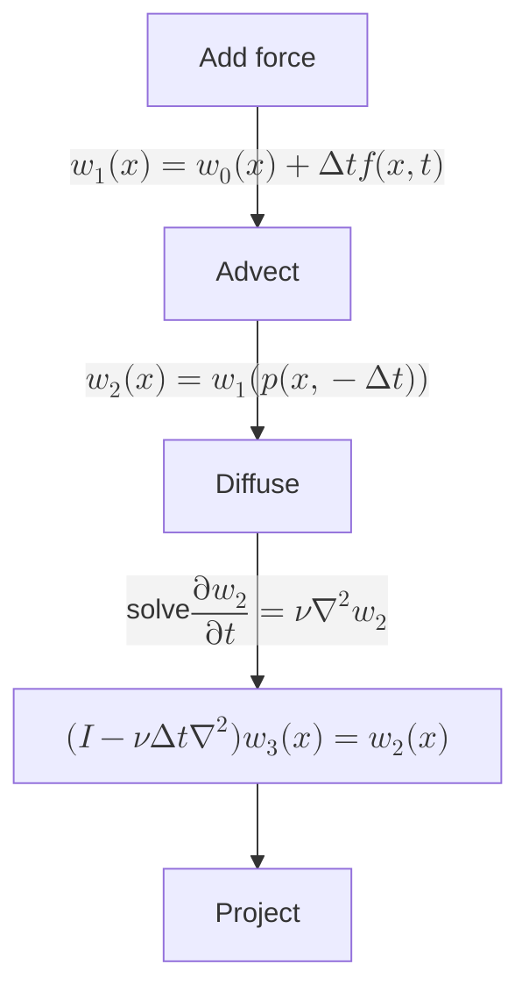

# Prerequisite knowledge

## Partial Derivatives
For a function of several variables, to find its partial derivative of a certain variable we can consider all the other variables as constants and apply the differentiation formula for one variable.
### Representation
For function of one variable, its derivative can be expressed as:$\frac{dy}{dx}$
For function of several variables, its derivative of a certain variable can be expressed as: $\frac{\partial f}{\partial x}$ or $f_{x}$

For example, a function $f(x,y) = 4x^3y^2+5x-7y$

$$
\begin{align}

f(x,y) &= 4x^3y^2 + 5x - 7y \\
\frac{\partial f}{\partial x} &= 12x^2y^2 + 5 \\
\frac{\partial f}{\partial y} &= 8x^3y -7
\end{align}
$$
## Gradient
Imagine the graph of the function of several variables as a mountain, the partial derivatives can tell us the slope of the mountain in one single direction. As for gradient of function of several variables, it is a vector of all the partial derivatives of the function.
### Representation
We use a symbol $\nabla$ called "Nabla" to represent the gradient operator. For a two dimensional function $f(x,y)$, its gradient can be expressed as:
$$
\nabla f = \left(\frac{\partial f}{\partial x}, \frac{\partial f}{\partial y} \right)
$$
### Physical meaning
1. The steepest direction: Still, imagine $f(x,y)$ as the height of a mountain, then $\nabla f$ at a certain point points to the direction where the slope is steepest and the height rises the fastest.
2. The size of the change rate: The $\lvert\nabla f\rvert$ represents how steep the slope is.

#### Proof:
Let's say that we are on somewhere on the function $f(x,y)$, we want to move a distance of $ds$ along the direction of an unit vector $\vec{v} = \left(\cos \theta, \sin \theta \right)$.
For function $f(x,y)$, its total derivative is:
$$
df = \frac{\partial f}{\partial x}dx + \frac{\partial f}{\partial y}dy
$$
Because we moved along the direction of $\vec{v}$, so:
$$
dx = ds \cos \theta, dy = ds \sin \theta
$$
Substitute these back in to the total derivative we will get:
$$
\begin{align}
df &= \frac{\partial f}{\partial x} (ds \cos \theta) + \frac{\partial f}{\partial y} (ds \sin \theta) \\
\frac{df}{ds} &= \frac{\partial f}{\partial x} \cos \theta + \frac{\partial f}{\partial y} \sin \theta \\
\frac{df}{ds} &= \left(\frac{\partial f}{\partial x}, \frac{\partial f}{\partial y} \right) \cdot \left(\cos \theta, \sin \theta \right) \\
\frac{df}{ds} &= \nabla f \cdot \vec{v} \\
\end{align}
$$
Because vector $\vec{v}$ is an unit vector, its magnitude is $1$, so:
$$
\frac{df}{ds} = \lvert \nabla f \rvert \cos \phi
$$

From this expression, it is easy to observe the two physical meaning above. The direction of $\nabla f$ is the direction of the function where the function value increases the fastest and $\left(\frac{df}{ds}\right)_{max}=\lvert \nabla f \rvert$.
## Divergence
Gradient can turn a scalar field into a vector field while divergence is its opposite, turning a vector field into a scalar field.
For a two dimensional vector field $\mathbf{u} = \left(u, v\right)$, its divergence is defined as:
$$
\nabla \cdot \mathbf{u} = \frac{\partial u}{\partial x}+ \frac{\partial v}{\partial y}
$$

### Physical meaning:
1. If $\nabla \cdot \mathbf{u} > 0$, the fluid is expanding, increasing volume, decreasing density.
2. If $\nabla \cdot \mathbf{u} < 0$, the fluid is being compressed, decreasing volume, increasing density.
3. If $\nabla \cdot \mathbf{u} = 0$, the fluid is an imcompressible fluids.

## Laplacian
We know that:
- $\nabla f$ turns a scalar field into a vector field
- $\nabla \cdot \mathbf{u}$ turns a vector field into a scalar field
Laplacian is to take the gradient of a scalar field to obtain a vector field, then take the divergence of this vector field, resulting in a new scalar field.
$$
\begin{align}
\nabla^2 f &= \nabla \cdot (\nabla f) \\
&= \nabla \cdot \left(\frac{\partial f}{\partial x}, \frac{\partial f}{\partial y}\right) \\
&= \frac{\partial}{\partial x}\left(\frac{\partial f}{\partial x}\right) + \frac{\partial}{\partial y} \left(\frac{\partial f}{\partial y}\right) \\
&= \frac{\partial^2 f}{\partial x^2} + \frac{\partial^2 f}{\partial y^2}
\end{align}
$$
### Physical meaning
1. If $\nabla^2 f(x,y) < 0$, this means that point $(x,y)$ is a "local bulge".
2. If $\nabla^2 f(x,y) > 0$, this means that point $(x,y)$ is a "local depression".

## Material derivative
It describe the rate of change of a physical quantity as observed by an observer moving with the flow of a fluid or material.
$$
\frac{D \mathbf{u}}{Dt} = \frac{\partial \mathbf{u}}{\partial t} + (\mathbf{u} \cdot \nabla)\mathbf{u}
$$
Let's say that we are travelling from Shanghai(10℃) to? Beijing(0℃). What's the rate of change of the temperature?
In three dimensional space, temperature $T$ is a function of several variables, it depends on where you are and the time:
$$
T = T(x,y,z,t)
$$
We are travelling through the space, the location of where we are are functions of time. Over time $t$, our position changes:
$$
x = x(t), y = y(t), z = z(t)
$$
So, temperature $T$ is actually a composite function which can be expressed as:
$$
T = (x(t), y(t), z(t), t)
$$
We want to know the rate of change of the temperature
$$
\begin{align}
\frac{dT}{dt} &= \frac{\partial T}{\partial x} \frac{dx}{dt} + \frac{\partial T}{\partial y} \frac{dy}{dt} + \frac{\partial T}{\partial z} \frac{dz}{dt} + \frac{\partial T}{\partial t} \frac{dt}{dt} \\
\frac{dT}{dt} &= \left(\frac{\partial T}{\partial x} \frac{dx}{dt} + \frac{\partial T}{\partial y} \frac{dy}{dt} + \frac{\partial T}{\partial z} \frac{dz}{dt}\right) + \frac{\partial T}{\partial t} \\
\frac{dT}{dt} &= \frac{\partial T}{\partial t} + \left(\frac{\partial T}{\partial x}v_x + \frac{\partial T}{\partial y} v_y + \frac{\partial T}{\partial z} v_z \right) \\
\frac{dT}{dt} &= \frac{\partial T}{\partial t} + \left(v_x, v_y, v_z \right) \cdot \left(\frac{\partial T}{\partial x}, \frac{\partial T}{\partial y}, \frac{\partial T}{\partial z}\right) \\
\frac{dT}{dt} &= \frac{\partial T}{\partial t} + \mathbf{v} \cdot \nabla T
\end{align}
$$

## Forward Euler
The core iterative formula of the explicit Euler method:
$$
f^{n+1} = f^n + \Delta t \cdot g(f^{n})
$$
### Why would forward Euler method numerical blow up?
Let's say that a differential equation of certain variable in a physics system:
$$
\frac{df}{dt} = - af (a>0)
$$
$f$ here can be a sort of damping, as the time goes it should converge to zero.
We discretize the expression and write it in the form of forward Euler method:
$$
\begin{align}
\frac{df}{dt} &= - af (a>0) \\
\frac{f^{n+1} - f^{n}}{\Delta t} &= -a f^{n} \\
f^{n+1} &= f^n - a \Delta t f^n \\
f^{n+1} &= (1 - a \Delta t) f^n \\
\end{align}
$$
It is a recursive sequence and we can easily write the expression of its initial term and its nth term:
$$
f^n = (1-a\Delta t)^n f^0
$$
$f$ will converge to zero, so we can obtain an inequation:
$$
\begin{align}
\lvert 1 - a \Delta t \rvert < 1 \\
-1 < 1 - a \Delta t < 1 \\
0 < \Delta t < \frac{2}{a} \\
\end{align}
$$
So, when $\Delta t$ increases and $\Delta t > \frac{2}{a}$, numerical blow up appears.

## Backward Euler
Backward Euler is the method used in the paper and it is one of the reason that no matter how long the $\Delta t$ is numerical blow up won't happen.
Still, the equation:
$$
\frac{df}{dt} = -a f (a > 0)
$$
Backward Euler uses the future $n+1$ to calculate the rate of change:
$$
\frac{f^{n+1} - f^n}{\Delta t} = -a f^{n+1}
$$
Transpose and simplify the equation:
$$
\begin{align}
f^{n+1} + a\Delta t \cdot f^{n+1} &= f^{n} \\
(1+a\Delta t) f^{n+1} &= f^n \\
f^{n+1} &= \frac{1}{1+a\Delta t} f^{n}
\end{align}
$$
Same, we can obtain the equation of its initial term and nth term
$$
f^n = (\frac{1}{1+a\Delta t})^n f^0
$$
Since $a>0, \Delta t>0$
$$
0 < \frac{1}{1+a\Delta t} < 1
$$
So, no numerical blow up in this case.
But the cost of backward Euler is that in order to get $f^{n+1}$, the computer need to handle a massive linear equation by using algorithms like Jacobi iteration.Computer need to iterate many times to get close to the solution for $f^{n+1}$.
## Central Difference
In simulations, we split the space into grids, formulas in the paper involves calculations about gradient and divergence which uses partial derivatives.
$$
\nabla f = \left(\frac{\partial f}{\partial x}, \frac{\partial f}{\partial y} \right)
$$
Lets say that we have a one dimensional grid:
```
		 i-1           i             i+1      
----------+------------+--------------+---------------
      f(x-△x)        f(x)            f(x+△x)
```
There are three ways to calculate these partial derivatives:
1. Forward Difference:
	$$
	\frac{\partial f}{\partial x} \approx \frac{f_{i+1} - f_{i}}{\Delta x}
	$$
2. Backward Difference:
	$$
	\frac{\partial f}{\partial x} \approx \frac{f_{i} - f_{i-1}}{\Delta x}
	$$
3. Central Difference:
	$$
	\frac{\partial f}{\partial x} \approx \frac{f_{i+1} - f_{i-1}}{2 \Delta x}
	$$
Central difference are much more accurate than the other two method.
Proof:
We know that for function $f(x+\Delta x)$ its Taylor Expansion is:
$$
f(x+\Delta x) = f(x) + \Delta x \cdot f\prime(x) + \frac{\Delta x^2}{2!} \cdot f\prime\prime(x) + \frac{\Delta x^3}{3!} \cdot f\prime\prime\prime(x) + \cdots 
$$
For the two neighbors $f_{i+1}, f_{i-1}$, by using Taylor Expansion we can obtain:
$$
\begin{align}
f_{i+1} &= f_{i} + \Delta x f\prime_{i} + \frac{\Delta x^2}{2} \cdot f\prime\prime_i + \frac{\Delta x^3}{6} \cdot f\prime\prime\prime_i + O(\Delta x^4) \\
f_{i-1} &= f_{i} - \Delta x f\prime_{i} + \frac{\Delta x^2}{2} \cdot f\prime\prime_i - \frac{\Delta x^3}{6} \cdot f\prime\prime\prime_i + O(\Delta x^4) 
\end{align}
$$
We use $f_{i+1} - f_{i-1}$ to obtain the central difference formula:
$$
\begin{align}
f_{i+1} - f_{i-1} &= 2 \Delta x f\prime_i + \frac{\Delta x^3}{3} \cdot f\prime\prime\prime_i + O(\Delta x^4) \\
f\prime_i &= \frac{f_{i+1} - f_{i-1}}{2\Delta x} - \frac{\Delta x^2}{6} \cdot f\prime\prime\prime_i + O(\Delta x^4) \\
Error &\approx C \cdot \Delta x^2
\end{align}
$$
While forward difference and backward difference will result in $Error \approx C \cdot \Delta x$ .

# Paper
As written in the paper, ` Our method cannot be found in the com- putational fluids literatur`, they used both Lagrangian and implicit methods to solve the Navier-Stokes equations demonstrated great nice swirling flows despite the numerical dissipation.
Navier-Stokes equation:
$$
\begin{align}
\nabla \cdot \mathbf{u} &= 0 \\
\frac{\partial \mathbf{u}}{\partial t} &= -(\mathbf{u} \cdot \nabla) \mathbf{u} - \frac{1}{\rho} \nabla p + \nu \nabla^2 \mathbf{u} + \mathbf{f}
\end{align}
$$
where $\nu$ is the kinematic viscosity of the fluid, $\rho$ is its density and $\mathbf{f}$ is an external force.
According to Helmholtz-Hodge Decomposition, any vector field $\mathbf{w}$ can uniquely be decomposed into the form:
$$
\mathbf{w} = \mathbf{u} + \nabla q
$$
where $\mathbf{u}$ has zero divergence, $\nabla \cdot \mathbf{u} = 0$ and $q$ is a scalar field.
To get our fundamental equation for our solver, which should not contain $p$, we need to do something based on the Navier-Stokes equation above.
$$
\begin{align}
\nabla \cdot \mathbf{w} &= \nabla \cdot (\mathbf{u} + \nabla q) \\
\nabla \cdot \mathbf{w} &= \nabla \cdot \mathbf{u} + \nabla \cdot \nabla q
\end{align}
$$
Because of that $\nabla \cdot \mathbf{u} = 0$, we can obtain
$$
\nabla \cdot \mathbf{w} = \nabla^2 q
$$
In the paper, they defined an projection operator $\mathbf{P}$ which projects any vector field $\mathbf{w}$ onto its divergence free part
$$
\mathbf{u} = \mathbf{P} \mathbf{w} = \mathbf{w} - \nabla q
$$
To obtain a single equation for the velocity, we apply the projection operator on both sides of the Navier-Stokes equation:
$$
\mathbf{P} \left(\frac{\partial \mathbf{u}}{\partial t}\right) = \mathbf{P} \left(-(\mathbf{u} \cdot \nabla) \mathbf{u} - \frac{1}{\rho}\nabla p + \nu \nabla^2 \mathbf{u} + f \right)
$$
Since $\mathbf{u}$ has zero divergence, we can get
$$
\begin{align}
\mathbf{P} \mathbf{u} = \mathbf{u}, \mathbf{P} \nabla p = 0
\end{align}
$$
So,  the equation becomes:
$$
\frac{\partial \mathbf{u}}{\partial t} = \mathbf{P} \left(-(\mathbf{u} \cdot \nabla) \mathbf{u} + \nu \nabla^2 \mathbf{u} + f \right)
$$

## Periodic boundary conditions
In every single time step $\Delta t$, four steps are taken:
1. Add force
2. Advect
3. Diffuse
4. Project



In this case, the simulation is under periodic boundary conditions. In the paper, they introduced an extremely elegant way to solve the massive equations with FFT.

## Fixed boundary conditions
It is basically the same as under the periodic boundary conditions, but different in the way of dealing the equations when entering the stage "Diffuse" and "Project" which both needs to solve a huge equation. The specialty of the periodic boundary condition makes the solution for these equations are very easy to find by using FFT. But under fixed boundary conditions, solving these equation will be a problem since FFT can't be used here. In the paper, they used FISHPAK to solve these equations.