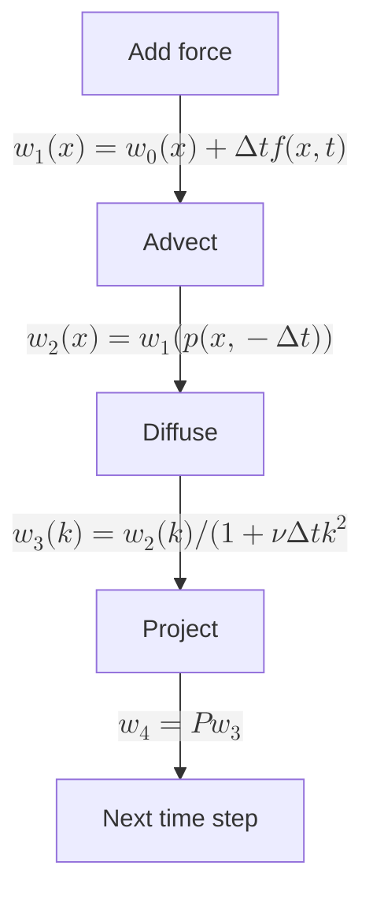
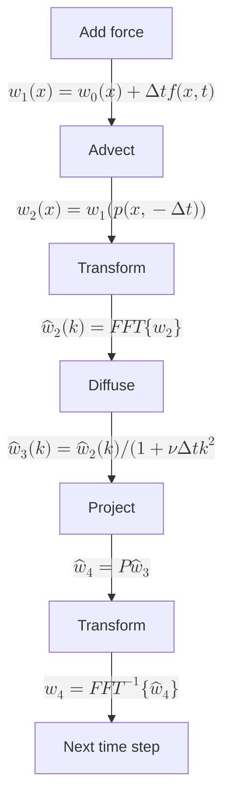

# Overview
A project of a 3D fluid simulation reproducing **Jos Stam's *Stable Fluids* (SIGGRAPH 1999)** paper.  Built with ImGui + OpenGL 3.3, featuring volume ray-marching and full simulation pipeline under both periodic and fixed boundary conditions. This is the note which I will try to explain the codes which is related to the paper in the [repository](https://github.com/EMEEEEMMMM/FluidSimulationRP). 
```          
├─include
│  │  Application.hpp
│  │  Camera.hpp
│  │  FluidRenderer.hpp
│  │  FluidSolver.hpp
│  │  FrameBuffer.hpp
│  │  ImguiLayer.hpp
│  │  OpenGLLayer.hpp
│  │  
│  └─Math
│          Constants.hpp
│          FFT.hpp
│          Grid3D.hpp
│          Matrix4.hpp
│          PoissonSolver.hpp
│          Vector3.hpp
│          
├─reference
│      stam-stable_fluids.pdf
│      
├─src
│  │  Application.cpp
│  │  FluidRenderer.cpp
│  │  FluidSolver.cpp
│  │  FrameBuffer.cpp
│  │  ImguiLayer.cpp
│  │  main.cpp
│  │  OpenGLLayer.cpp
│  │  
│  └─ShaderProgram
│          fragment_shader.frag
│          ray_march.frag
│          ray_march.vert
│          Shader.cpp
│          Shader.h
│          vertex_shader.vert
```
## Grid3D
This is the core data type in the project which stores basically everything which is important:
```c++
// Cell-centered fields [Nx][Ny][Nz]
Math::Grid3D<float> density, densityPrev, pressure;
// Staggered MAC velocity
// u(i,j,k) = x-velocity at face (i, j+½, k+½)       [Nx+1][Ny][Nz]
// v(i,j,k) = y-velocity at face (i+½, j, k+½)       [Nx][Ny+1][Nz]
// w(i,j,k) = z-velocity at face (i+½, j+½, k)       [Nx][Ny][Nz+1]
Math::Grid3D<float> u, uPrev, v, vPrev, w, wPrev;
```
Every grid is a one dimensional array which maps 3D coordinates to 1D linear addresses.
The mapping formula (row-major order, z changes slowest, x changes fastest):

$$
\text{index} = (k \cdot ny + j) \cdot nx + i
$$

Intuitively, imagine the 3D grid as a stack of 2D sheets (one per z-layer). Each sheet has $ny$ rows and $nx$ columns:

- $k \cdot ny \cdot nx$ : skip $k$ whole sheets to reach the correct z-layer
- $j \cdot nx$ : within that sheet, skip $j$ rows
- $i$ : within that row, go to the $i$-th column

```c++
inline T& operator()(int i, int j, int k) {
    return data[(k * ny + j) * nx + i];
}
```

### Trilinear Interpolation

In the Advect step, particles are traced backward through the velocity field. The traced-back position $p(x, -\Delta t)$ almost never lands exactly on a grid point. We need to interpolate the velocity at arbitrary fractional coordinates. Trilinear interpolation is the 3D extension of linear interpolation.

#### 1D Linear Interpolation

Given two known values $f(0)$ and $f(1)$, the value at a fractional position $t \in [0,1]$ is:

$$
f(t) = (1-t) \cdot f(0) + t \cdot f(1)
$$

- $t=0$ : $f(0)$（fully at the left endpoint）
- $t=1$ : $f(1)$（fully at the right endpoint）
- $t=0.5$ : the average of the two

The two weights sum to 1: $(1-t) + t = 1$.

#### 2D Bilinear Interpolation

For a unit square with 4 corner values $f_{00}, f_{10}, f_{01}, f_{11}$, and a point $(x,y)$ inside:

**Step 1**: Interpolate along x on the bottom edge ($y=0$) and top edge ($y=1$):

$$
\begin{align}
f_{\text{bottom}} &= (1-x)f_{00} + x f_{10} \\
f_{\text{top}}    &= (1-x)f_{01} + x f_{11}
\end{align}
$$

**Step 2**: Interpolate along y between the two results:

$$
f(x,y) = (1-y)f_{\text{bottom}} + y f_{\text{top}}
$$

Expanding into one formula:

$$
f(x,y) = (1-x)(1-y)f_{00} + x(1-y)f_{10} + (1-x)y f_{01} + xy f_{11}
$$

The 4 weights are products of the per-axis weights. Each corner's weight is large when the sample point is close to that corner.

#### 3D Trilinear Interpolation

For a unit cube with 8 corner values, the same logic applies. For a point $(x,y,z)$ inside:

**Step 1**: Perform bilinear interpolation on the $z=0$ face and the $z=1$ face:

$$
\begin{align}
f_{z0} &= (1-x)(1-y)f_{000} + x(1-y)f_{100} + (1-x)y f_{010} + xy f_{110} \\
f_{z1} &= (1-x)(1-y)f_{001} + x(1-y)f_{101} + (1-x)y f_{011} + xy f_{111}
\end{align}
$$

**Step 2**: Interpolate along z between the two face results:

$$
f(x,y,z) = (1-z)f_{z0} + z f_{z1}
$$

Expanding fully — 8 terms, each corner weighted by the product of three per-axis weights:

$$
\begin{aligned}
f(x,y,z) = &\quad (1-x)(1-y)(1-z) \cdot f_{000} \\
         + &\quad x(1-y)(1-z) \cdot f_{100} \\
         + &\quad (1-x)y(1-z) \cdot f_{010} \\
         + &\quad xy(1-z) \cdot f_{110} \\
         + &\quad (1-x)(1-y)z \cdot f_{001} \\
         + &\quad x(1-y)z \cdot f_{101} \\
         + &\quad (1-x)yz \cdot f_{011} \\
         + &\quad xyz \cdot f_{111}
\end{aligned}
$$

#### Code Implementation

```c++
inline T sample(float x, float y, float z) const {
    // Clamp to valid range
    x = x < 0.0f ? 0.0f : (x > (float)(nx-1) ? (float)(nx-1) : x);
    y = y < 0.0f ? 0.0f : (y > (float)(ny-1) ? (float)(ny-1) : y);
    z = z < 0.0f ? 0.0f : (z > (float)(nz-1) ? (float)(nz-1) : z);

    // Integer corner indices
    int i0 = (int)x, i1 = i0 + 1; if (i1 >= nx) i1 = nx - 1;
    int j0 = (int)y, j1 = j0 + 1; if (j1 >= ny) j1 = ny - 1;
    int k0 = (int)z, k1 = k0 + 1; if (k1 >= nz) k1 = nz - 1;

    // Fractional parts = interpolation weights along each axis
    float fx = x - (float)i0, fy = y - (float)j0, fz = z - (float)k0;
    float fx1 = 1.0f - fx, fy1 = 1.0f - fy, fz1 = 1.0f - fz;

    const T* d = data.data();
    int sy = nx, sz = nx * ny;  // strides

    // 8 corner indices
    int i000 = (k0 * sz) + (j0 * sy) + i0;
    int i100 = (k0 * sz) + (j0 * sy) + i1;
    int i010 = (k0 * sz) + (j1 * sy) + i0;
    int i110 = (k0 * sz) + (j1 * sy) + i1;
    int i001 = (k1 * sz) + (j0 * sy) + i0;
    int i101 = (k1 * sz) + (j0 * sy) + i1;
    int i011 = (k1 * sz) + (j1 * sy) + i0;
    int i111 = (k1 * sz) + (j1 * sy) + i1;

    // Factorised trilinear interpolation (14 multiplies + 7 adds)
    return fx1 * (fy1 * (fz1 * d[i000] + fz * d[i001])
                + fy  * (fz1 * d[i010] + fz * d[i011]))
         + fx  * (fy1 * (fz1 * d[i100] + fz * d[i101])
                + fy  * (fz1 * d[i110] + fz * d[i111]));
}
```

## FFT
Among the stages of every single time step, two of them requires to solve a large sparse linear system which are *Diffuse* and *Project*.
The two equation that are required to solve:
1. *Diffuse*: $(\mathbf{I} - \nu \Delta t \nabla^2)\mathbf{w}_3 = \mathbf{w}_2$
2. *Project*: $\nabla^2 q = \nabla \cdot \mathbf{w}_3$

Under periodic boundary condition, FFT can solve these equation fast and elegant.
For Poisson equation $\nabla^2 p = rhs$, do Fourier transform on both sides of the equation:
$$
\begin{align}
\mathcal{F}\{\nabla^2p\} &= \mathcal{F}\{rhs\} \\
-(k_x^2 + k_y^2 + k_z^2)\hat p(\mathbf{k}) &= \widehat{rhs}(\mathbf{k}) \\
\therefore \hat p(\mathbf{k}) &= -\frac{\widehat{rhs}(\mathbf{k})}{\lvert\mathbf{k}\rvert^2}
\end{align}
$$


For the stage *Diffuse*  equation $(\mathbf{I} - \nu \Delta t \nabla^2)\mathbf{w}_3 = \mathbf{w}_2$,

$$
\begin{align}
\mathcal{F}\{(\mathbf{I} - \nu \Delta t \nabla^2)\mathbf{w}_3\} &= \mathcal{F}\{\mathbf{w}_2\} \\
\hat{\mathbf{w}}_3 (\mathbf{k}) - \nu \Delta t \cdot (-\lvert\mathbf{k}^2\rvert)\hat{\mathbf{w}}_3(\mathbf{k}) &= \hat{\mathbf{w}}_2(\mathbf{k}) \\
(1+\nu \Delta t \lvert\mathbf{k}\rvert^2)\hat{\mathbf{w}}_3(\mathbf{k}) &= \hat{\mathbf{w}}_2(\mathbf{k}) \\
\therefore \hat{\mathbf{w}}_3(\mathbf{k}) &= \frac{\hat{\mathbf{w}}_2(\mathbf{k})}{1 + \nu \Delta t \lvert k \rvert ^2}
\end{align}
$$

In actual calculations, we operate on discrete meshes, using the central difference approximation Laplace operator.

$$
\nabla^2 p \approx \frac{p_{i+1,j,k} - 2p_{i,j,k} + p_{i-1,j,k}}{\Delta x^2} + \frac{p_{i,j+1,k} - 2p_{i,j,k} + p_{i,j-1,k}}{\Delta y^2} + \frac{p_{i,j,k+1} - 2p_{i,j,k} + p_{i,j,k-1}}{\Delta z^2}
$$

On an uniform grid $\Delta x=\Delta y = \Delta z = dx$, the eigenvalue of this discrete operator is:

$$
\lambda(i,j,k) = \frac{2}{dx^2}\left[\cos\left(\frac{2\pi i}{N_x}\right) + \cos\left(\frac{2\pi j}{N_y}\right) + \cos\left(\frac{2\pi k}{N_z}\right) - 3\right]
$$

We precompute this eigenvalue so that when solving the equation just multiply it saving time. 

```c++
float cx = std::cos(2.0f * M_PI * i / m_Nx);   // cos(2πp/Nx)
float cy = std::cos(2.0f * M_PI * j / m_Ny);   // cos(2πq/Ny)
float cz = std::cos(2.0f * M_PI * k / m_Nz);   // cos(2πr/Nz)
float eig = 2.0f * (cx + cy + cz - 3.0f) / dx2; // λ(p,q,r)
m_Eigen[(int)idx] = skip ? 0.0f : 1.0f / eig;  // 预存 1/λ
```

### Cooley-Tukey FFT:

The definition of the one-dimensional Discrete Fourier Transform(DFT):
$$
X_k = \sum_{n=0}^{N-1} x_n e^{-2\pi i kn / N}
$$
Break down the DFT into two DFTs with an even index and an odd index:
$$
X_k = \underbrace{\sum_{m=0}^{N/2-1} x_{2m} e^{-2\pi i k (2m) / N}}_{\text{even}} + \underbrace{\sum_{m=0}^{N/2-1} x_{2m+1} e^{-2\pi i k (2m+1) / N}}_{\text{odd}}
= E_k + e^{-2\pi i k / N} O_k
$$
Let $W_N^k = e^{-2\pi i k / N}$, it is called the rotating factor.
The properties of this factor can be easily seen:
$$
W_N^{k + \frac{N}{2}} = e^{-2\pi i \frac{k + \frac{N}{2}}{N}} = e^{-2\pi i \frac{k}{N}} \cdot e^{-\pi i} = -W^k_N
$$
So, for $k = 0, 1, \cdots, N/2-1$
$$
\begin{align}
\hat{x}_k &= E_k + W_N^k \cdot O_k \\
\hat{x}_{k + N/2} &= E_{k + N/2} + W_N^{k + N/2} \cdot O_{k + N/2} \\
&= E_k - W_N^k \cdot O_k
\end{align}
$$
Continue splitting for two $N/2$ point DFTs until $N=2$. The code is recursive and is calculated by butterfly operator.
Bit-reversal permutation:
```c++
for (int i = 1, j = 0; i < n; i++) {
	int bit = n >> 1;
	for (; j & bit; bit >>= 1) j ^= bit;
	j ^= bit;
	if (i < j) { 
		std::swap(real[i], real[j]);
		std::swap(imag[i],imag[j]); 
	}
}
```
Butterfly:
```c++
for (int len = 2; len <= n; len <<= 1) {
	float ang = 2.0f * (float)M_PI / len * sign;
	float wR = std::cos(ang), wI = std::sin(ang);
	for (int i = 0; i < n; i += len) {
		float curR = 1.0f, curI = 0.0f;
		for (int j = 0; j < len/2; j++) {
			int u = i + j, v = i + j + len/2;
			float tR = curR * real[v] - curI * imag[v];
			float tI = curR * imag[v] + curI * real[v];
			real[v] = real[u] - tR;
			imag[v] = imag[u] - tI;
			real[u] += tR;
			imag[u] += tI;
			float nR = curR * wR - curI * wI;
			curI = curR * wI + curI * wR;
			curR = nR;
		}
	}
}
```

For three-dimensional, do one-dimensional DFT along the three dimensional, and it doesn't the order of which dimension had been calculated first
$$
\mathcal{F}_{3D}\{x\} = \mathcal{F}_x \{\mathcal{F}_y \{\mathcal{F}_z \{x\}\}\}
$$
Proof:
Let $x[i,j,k]$ is a $N_x \times N_y \times N_z$ three-dimensional array，its 3D DFT  is:
$$
\begin{align}
\hat{x}[p,q,r] &= \sum_{i=0}^{N_x-1} \sum_{j=0}^{N_y-1} \sum_{k=0}^{N_z-1} x[i,j,k] \cdot e^{-2\pi i \left(\frac{p\cdot i}{N_x} + \frac{q\cdot j}{N_y} + \frac{r\cdot k}{N_z}\right)} \\
\hat{x}[p,q,r] &= \sum_{i=0}^{N_x-1} \sum_{j=0}^{N_y-1} \sum_{k=0}^{N_z-1} x[i,j,k] \cdot e^{-2\pi i \frac{pi}{N_x}} \cdot e^{-2\pi i \frac{qj}{N_y}} \cdot e^{-2\pi i \frac{rk}{N_z}} \\
\hat{x}[p,q,r] &= \sum_{i=0}^{N_x-1} \underbrace{\left[ \sum_{j=0}^{N_y-1} \underbrace{\left( \sum_{k=0}^{N_z-1} x[i,j,k] \cdot e^{-2\pi i \frac{rk}{N_z}} \right)}_{\text{along z-axis 1D DFT}} \cdot e^{-2\pi i \frac{qj}{N_y}} \right]}_{\text{along y-axis 1D DFT}} \cdot e^{-2\pi i \frac{pi}{N_x}} \\
\therefore \mathcal{F}_{3D}\{x\} &= \mathcal{F}_x \{\mathcal{F}_y \{\mathcal{F}_z \{x\}\}\}
\end{align}
$$

## PoissonSolver
In the paper, FISHPAK was used to deal with the linear equations. In my reproduction, Jacobi iteration was used to deal with the linear equation. It is super easy to implement the code.
### Derivation:
For Poisson equaton:
$$
\nabla^2p = rhs
$$
where $\nabla^2p = \frac{\partial^2 p}{\partial x^2}+\frac{\partial^2 p}{\partial y^2}+\frac{\partial^2 p}{\partial z^2}$

In order to compute it, we need to discrete the Laplace operator:

$$
\begin{align}
p_{i+1} &= p_i + \Delta x \cdot p'_i + \frac{\Delta x^2}{2!} \cdot p''_i + \frac{\Delta x^3}{3!} \cdot p'''_i + \frac{\Delta x^4}{4!} \cdot p^{(4)}_i + O(\Delta x^5) \\
p_{i-1} &= p_i - \Delta x \cdot p'_i + \frac{\Delta x^2}{2!} \cdot p''_i - \frac{\Delta x^3}{3!} \cdot p'''_i + \frac{\Delta x^4}{4!} \cdot p^{(4)}_i + O(\Delta x^5)
\end{align}
$$

Add the two formula together, solve for $p''_i$:

$$
\begin{align}
p_{i+1} + p_{i-1} &= \left(p_i + p_i\right) + \left(\frac{\Delta x^2}{2} p''_i + \frac{\Delta x^2}{2} p''_i\right) + \left(\frac{\Delta x^4}{24} p^{(4)}_i + \frac{\Delta x^4}{24} p^{(4)}_i\right) + \cdots \\
p_{i+1} + p_{i-1} &= 2p_i + \Delta x^2 p''_i + \frac{\Delta x^4}{12} p^{(4)}_i + \cdots \\
\Delta x^2 p''_i &= p_{i+1} + p_{i-1} - 2p_i + O(\Delta x^4) \\
p''_i &\approx \frac{p_{i+1} - 2p_i + p_{i-1}}{\Delta x^2} \\
\end{align}
$$

We do this kind of operation for each of the three dimensions:

$$
(\nabla^2_d p)[i,j,k] = \quad \frac{p_{i+1,j,k} - 2p_{i,j,k} + p_{i-1,j,k}}{\Delta x^2} + \frac{p_{i,j+1,k} - 2p_{i,j,k} + p_{i,j-1,k}}{\Delta y^2} + \frac{p_{i,j,k+1} - 2p_{i,j,k} + p_{i,j,k-1}}{\Delta z^2}
$$

Under uniform grid $\Delta x = \Delta y = \Delta z = dx$, :

$$
(\nabla^2_d p)[i,j,k] = \frac{p_{i+1} + p_{i-1} + p_{j+1} + p_{j-1} + p_{k+1} + p_{k-1} - 6p_{i,j,k}}{dx^2}
$$

So, substitute this into our original equation and solve for $p_{i,j,k}$:

$$
\begin{align}
\frac{p_{i+1} + p_{i-1} + p_{j+1} + p_{j-1} + p_{k+1} + p_{k-1} - 6p_{i,j,k}}{dx^2} &= rhs_{i,j,k} \\
p_{i+1} + p_{i-1} + p_{j+1} + p_{j-1} + p_{k+1} + p_{k-1} - dx^2 \cdot rhs_{i,j,k} &= 6 p_{i,j,k} \\
p_{i,j,k} &= \frac{p_{i+1} + p_{i-1} + p_{j+1} + p_{j-1} + p_{k+1} + p_{k-1} - dx^2 \cdot rhs_{i,j,k}}{6}
\end{align}
$$

This is the core equation for Jacobi iteration and the code implementation:
```c++
for (int iter = 0; iter < maxIter; iter++) {
	for (int k = 0; k < Nz; k++) {
		for (int j = 0; j < Ny; j++) {
			for (int i = 0; i < Nx; i++) {
				// Dirichlet BC: p=0 on boundary faces
				float pL = (i > 0)      ? solution[idx(i-1,j,k,Nx,Ny,Nz)] :0.0f;
				float pR = (i < Nx - 1)  ? solution[idx(i+1,j,k,Nx,Ny,Nz)] :0.0f;
				float pD = (j > 0)      ? solution[idx(i,j-1,k,Nx,Ny,Nz)] :0.0f;
				float pU = (j < Ny - 1)  ? solution[idx(i,j+1,k,Nx,Ny,Nz)] :0.0f;
				float pB = (k > 0)      ? solution[idx(i,j,k-1,Nx,Ny,Nz)] :0.0f;
				float pF = (k < Nz - 1)  ? solution[idx(i,j,k+1,Nx,Ny,Nz)] :0.0f;
				int id = idx(i,j,k,Nx,Ny,Nz);
				next[id] = (pL + pR + pD + pU + pB + pF - dx2 * rhs[id]) * inv6;
			}
		}
	}
	std::swap(solution, next);
}
```
The derivation for the *Diffuse* equation is mostly the same in logic but the expression differs slightly.
$$
u^{\text{new}} = \frac{u^{\text{old}} + \alpha \cdot (u_L + u_R + u_D + u_U + u_B + u_F)}{1 + 6\alpha}
$$
## Ray_shader
### Volume Rendering
https://zhuanlan.zhihu.com/p/639892534
## FluidSolver
This is the most important part in the project where the whole process of every time step are coded here.
For fixed boundary condition:

For periodic boundary condition:


Above all these process, only stage *Add force* and stage *Advect* are not involved.
### Add Force
The derivation for this stage is quite simple.
Back to the Navier Stokes equation:
$$
\frac{\partial \mathbf{u}}{\partial t} = -(\mathbf{u} \cdot \nabla) \mathbf{u} - \frac{1}{\rho} \nabla p + \nu \nabla^2 \mathbf{u} + \mathbf{f}
$$
We only care about $\mathbf{f}$ in this stage:
$$
\frac{\partial \mathbf{u}}{\partial t} = \mathbf{f}
$$
Using Forward Euler:
$$
\begin{align}
\frac{\mathbf{u}^{n+1} - \mathbf{u}^{n}}{\Delta t} &= \mathbf{f} (\mathbf{x}, t^n) \\
\mathbf{u}^{n+1} &= \mathbf{u}^{n} + \Delta t \cdot \mathbf{f}(\mathbf{x}, t^n)
\end{align}
$$
Two forces in the project:
1. Buoyancy $\mathbf{f} = (0, \alpha \cdot \rho, 0)$  $v^{n+1} = v^{n} + \alpha \cdot \rho \cdot \Delta t$
2. User $\mathbf{f}(\mathbf{x}) = \mathbf{v}_{input} \cdot \max\left(0, 1 - \frac{\lvert \mathbf{x} - \mathbf{x}_{mouse}\rvert}{r}\right)$

### Advect
We care about $-(\mathbf{u} \cdot \nabla)\mathbf{u}$ in this stage:
$$
\frac{\partial \mathbf{u}}{\partial t} = -(\mathbf{u} \cdot \nabla)\mathbf{u}
$$
or, written as the material derivative:
$$
\frac{D\mathbf{u}}{Dt} = 0
$$
where $\frac{D}{Dt} = \frac{\partial}{\partial t} + \mathbf{u} \cdot \nabla$
#### Physical meaning:
$\frac{D}{Dt}$ describes the rate of change experienced by an observer moving with the flow. $\frac{D\mathbf{u}}{Dt} = 0$ means that a fluid particle carries its velocity unchanged as it moves along the flow — like a balloon drifting with the wind, always feeling the same wind speed at its own position.
#### Method of Characteristics
Define a particle trajectory $\mathbf{p}(\mathbf{x}, s)$ such that:
$$
\frac{d\mathbf{p}}{ds} = \mathbf{u}(\mathbf{p}, s), \qquad \mathbf{p}(\mathbf{x}, t+\Delta t) = \mathbf{x}
$$
$\mathbf{p}(\mathbf{x}, s)$ answers the question: "the particle that arrives at position $\mathbf{x}$ at time $t+\Delta t$ — where was it at an earlier time $s$?"

Let $\tilde{\mathbf{u}}(s) = \mathbf{u}(\mathbf{p}(\mathbf{x}, s), s)$ be the velocity measured along the trajectory. Its rate of change:

$$
\begin{align}
\frac{d\tilde{\mathbf{u}}}{ds} &= \frac{\partial\mathbf{u}}{\partial s} + \frac{d\mathbf{p}}{ds} \cdot \nabla\mathbf{u} \\
&= \frac{\partial\mathbf{u}}{\partial s} + \mathbf{u} \cdot \nabla\mathbf{u} \\
&= \frac{D\mathbf{u}}{Ds} = 0
\end{align}
$$

This proves $\tilde{\mathbf{u}}(s)$ is constant along the characteristic. In particular:

$$
\tilde{\mathbf{u}}(t) = \tilde{\mathbf{u}}(t+\Delta t)
$$

which means:

$$
\mathbf{u}(\mathbf{p}(\mathbf{x}, t), t) = \mathbf{u}(\mathbf{p}(\mathbf{x}, t+\Delta t), t+\Delta t)
$$

Denote $\mathbf{x}_{\text{back}} = \mathbf{p}(\mathbf{x}, t)$ as the position at time $t$ that will arrive at $\mathbf{x}$ at time $t+\Delta t$. Then:

$$
\boxed{\mathbf{u}(\mathbf{x}, t+\Delta t) = \mathbf{u}(\mathbf{x}_{\text{back}}, t)}
$$

To find $\mathbf{x}_{\text{back}}$, trace backward from $\mathbf{x}$ using the velocity field:

$$
\mathbf{x}_{\text{back}} = \mathbf{x} - \int_{t}^{t+\Delta t} \mathbf{u}(\mathbf{p}(\mathbf{x}, \tau), \tau)\ d\tau
$$

With a first-order approximation (using velocity at the current position):

$$
\mathbf{x}_{\text{back}} \approx \mathbf{x} - \Delta t \cdot \mathbf{u}(\mathbf{x}, t)
$$

Hence the paper's formula:

$$
\mathbf{w}_2(\mathbf{x}) = \mathbf{w}_1(\mathbf{p}(\mathbf{x}, -\Delta t))
$$

#### Why it is unconditionally stable

$\mathbf{w}_2(\mathbf{x})$ is a value sampled from $\mathbf{w}_1$ via interpolation. Interpolated values are always bounded by the original data range — therefore $\max|\mathbf{w}_2| \le \max|\mathbf{w}_1|$. The field can never blow up regardless of $\Delta t$. The cost is numerical dissipation: linear interpolation smooths out fine details.
#### Advect Density

Density is a scalar quantity that is also carried by the fluid. Its governing equation is identical in form:

$$
\frac{D\rho}{Dt} = \frac{\partial\rho}{\partial t} + \mathbf{u} \cdot \nabla\rho = 0
$$

Density lives at cell centers $(i+0.5,\ j+0.5,\ k+0.5)$. The backtracing procedure is the same, except the sampled quantity is density rather than velocity:

```c++
for(int k=0;k<Nz;k++) for(int j=0;j<Ny;j++) for(int i=0;i<Nx;i++){
    float gx=(float)i+0.5f, gy=(float)j+0.5f, gz=(float)k+0.5f;
    float vu=SL_SampleU(gx,gy,gz), vv=SL_SampleV(gx,gy,gz), vw=SL_SampleW(gx,gy,gz);
    float tx=gx-dtdx*vu, ty=gy-dtdx*vv, tz=gz-dtdx*vw;
    if(bc==BoundaryCondition::Periodic){
        tx=safeWrap(tx-0.5f,nxf)+0.5f; ty=safeWrap(ty-0.5f,nyf)+0.5f; tz=safeWrap(tz-0.5f,nzf)+0.5f;
    }else{tx=tx<0.5f?0.5f:(tx>nxf-0.5f?nxf-0.5f:tx);ty=ty<0.5f?0.5f:(ty>nyf-0.5f?nyf-0.5f:ty);tz=tz<0.5f?0.5f:(tz>nzf-0.5f?nzf-0.5f:tz);}
    densityPrev(i,j,k)=SL_SampleDensity(tx,ty,tz);
}
```

where `SL_SampleDensity` is defined as:

```c++
float SL_SampleDensity(float gx,float gy,float gz) const {
    return density.sample(gx-0.5f, gy-0.5f, gz-0.5f);
}
```
